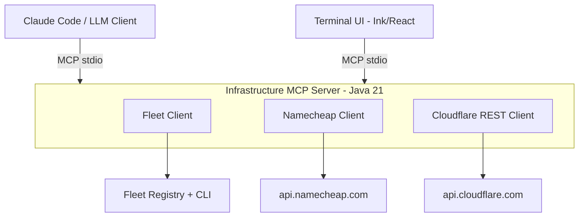

# Infrastructure MCP Server

[](https://github.com/wrxck/infrastructure-mcp/actions/workflows/ci.yml)
[](https://www.npmjs.com/package/infrastructure-tui)
[](https://openjdk.org/projects/jdk/21/)
[](https://nodejs.org/)
[](https://modelcontextprotocol.io/)
[]()
[](LICENSE)
[](https://infrastructure-mcp.hesketh.pro)

An [MCP (Model Context Protocol)](https://modelcontextprotocol.io/) server and interactive terminal UI that orchestrates **Cloudflare**, **Namecheap**, and **Fleet** from a single interface. One command to onboard a domain — zone creation, DNS migration, nameserver cutover, and **30+ security hardening settings** applied automatically. All free-tier compatible.

**Two ways to use it:**

- **With AI** — 12 MCP tools for Claude Code or any MCP-compatible LLM client
- **Without AI** — interactive terminal UI (Ink/React) with dashboard, wizards, and auditing

## What happens when you onboard a domain

```
1. Creates Cloudflare zone                         OK  Zone created
2. Fetches all DNS records from Namecheap          OK  16 records found
3. Migrates records to Cloudflare (with retry)     OK  16/16 migrated
4. Updates nameservers at Namecheap                OK  NS switched
5. Applies 30+ protection settings:
   |-- SSL strict + HSTS preload (1 year)          OK  SSL/TLS hardened
   |-- TLS 1.3 + 0-RTT + min TLS 1.2              OK  Transport secured
   |-- Bot Fight Mode + JS detection + AI blocking OK  Bots blocked
   |-- Free WAF Managed Ruleset deployed           OK  WAF active
   |-- DNSSEC enabled                              OK  DNS authenticated
   |-- Managed transforms (strip X-Powered-By,     OK  Headers hardened
   |   add security headers, visitor geolocation)
   |-- URL normalization                           OK  Path canonicalized
   |-- Brotli + HTTP/3 + Early Hints               OK  Speed optimized
   '-- Aggressive caching + 4hr browser TTL        OK  Cache configured
                                         Total: ~30 settings in <60 seconds
```

Every free-tier Cloudflare feature that improves security or performance — enabled, configured, and verified. No dashboard clicking, no missed settings, no "I'll do DNSSEC later."

## Interactive TUI

Don't want to use an AI agent? The TUI gives you the same capabilities in a keyboard-driven terminal interface.

```
infrastructure-tui

 Infrastructure MCP v1.2.0                          q quit  s settings  ? help
---------------------------------------------------------------------

 Cloudflare Zones
 +---------------------------+----------+----------+------------+----------+
 | Domain                    | Status   | Records  | Protection | SSL      |
 +---------------------------+----------+----------+------------+----------+
 | matthesketh.pro           | * active | 16       | all ok     | strict   |
 | abmanandvan.co.uk         | * active | 3        | all ok     | strict   |
 | hostclaw.app              | * active | 4        | all ok     | strict   |
 +---------------------------+----------+----------+------------+----------+

 Fleet Apps
   8 root domains, 19 total endpoints

 up/dn select   Enter details   o onboard   a audit all   r refresh
```

**Features:**
- Dashboard-first interface — see all zones and Fleet apps at a glance
- Domain onboarding wizard with confirmation before destructive actions
- Zone detail view with DNS records and full protection audit
- Bulk protection audit across all zones
- Setup wizard that adapts to your experience level — encourages source code review for learners

**Install from npm:**
```bash
npx infrastructure-tui
```

Or install globally:
```bash
npm install -g infrastructure-tui
infrastructure-tui
```

**From source:**
```bash
cd tui && npm install && npm start
```

First run? Add `--setup` to configure credentials:
```bash
npx infrastructure-tui --setup
```

## How it works



The TUI and AI clients both communicate with the same Java MCP server over stdio. All business logic — API calls, rate limiting, retry logic, credential handling — lives in the server. The TUI is a thin presentation layer with zero API duplication.

## Why this exists

Managing infrastructure across multiple providers means context-switching between dashboards, remembering different APIs, and running through the same checklist every time you onboard a domain. This project collapses that workflow into either a conversation or a terminal interface.

**For AI usage:** MCP gives you implicit security through human-in-the-loop approval. Destructive tools are annotated with `destructiveHint: true`, so the client gates them behind explicit approval.

**For TUI usage:** Every destructive action requires y/n confirmation. The setup wizard encourages users to review the source code before entering credentials.

**For both:** Content sanitization wraps untrusted DNS data in boundary markers to prevent prompt injection.

## Full protection suite

Every setting below is applied automatically during onboarding. All are Cloudflare free-tier compatible.

### SSL/TLS
| Setting | Value | Why |
|---------|-------|-----|
| SSL mode | **Strict** | Validates origin certificate, prevents MITM |
| Always Use HTTPS | On | 301 redirects all HTTP to HTTPS |
| Automatic HTTPS Rewrites | On | Fixes mixed content in page source |
| TLS 1.3 + 0-RTT | On | Fastest, most secure TLS with zero round-trip resumption |
| Minimum TLS Version | 1.2 | Rejects legacy TLS 1.0/1.1 connections |
| HSTS | 1 year, preload, includeSubDomains, nosniff | Eligible for browser HSTS preload lists |

### Security & WAF
| Setting | Value | Why |
|---------|-------|-----|
| Security Level | Medium | Challenges suspicious visitors via Cloudflare threat score |
| Browser Integrity Check | On | Blocks requests with missing or suspicious UA headers |
| Challenge TTL | 30 minutes | Balance between security and user friction |
| Bot Fight Mode | On + JS detection | Challenges known bots with JS challenge |
| AI Bot Blocking | Block | Blocks AI scrapers (GPTBot, CCBot, etc.) |
| Free WAF Managed Ruleset | Deployed | Cloudflare's curated WAF rules for common vulnerabilities |
| DDoS Protection | Always-on | Automatic L3/L4/L7 DDoS mitigation |
| DNSSEC | Enabled | Cryptographically signs DNS responses |
| Privacy Pass | On | Reduces challenge frequency for Privacy Pass token holders |

### Scrape Shield
| Setting | Value | Why |
|---------|-------|-----|
| Email Obfuscation | On | Hides email addresses from scrapers |
| Server Side Excludes | On | Hides `<!--sse-->` wrapped content from bots |
| Hotlink Protection | On | Blocks image hotlinking from other domains |

### Managed Transforms
| Transform | Direction | Effect |
|-----------|-----------|--------|
| Remove X-Powered-By | Response | Strips server technology fingerprint |
| Add Security Headers | Response | Adds CSP, X-Frame-Options, X-XSS-Protection |
| Add Visitor Location | Request | Adds CF-IPCountry, lat/lon to origin requests |

### Speed & Optimization
| Setting | Value | Why |
|---------|-------|-----|
| Brotli Compression | On | Smaller responses, faster page loads |
| HTTP/3 (QUIC) | On | Faster connections, especially on mobile |
| Early Hints (103) | On | Preload assets before main response |
| IP Geolocation | On | CF-IPCountry header for geo-aware apps |
| URL Normalization | Cloudflare, incoming | Canonicalizes URL paths to prevent cache poisoning |

### Caching & Network
| Setting | Value | Why |
|---------|-------|-----|
| Cache Level | Aggressive | Caches static content, ignores query strings |
| Browser Cache TTL | 4 hours | Reduces origin load without stale content risk |
| Always Online | On | Serves cached version if origin is down |
| IPv6 | On | Full IPv6 support on proxied records |
| WebSockets | On | WebSocket proxying for real-time apps |
| Opportunistic Encryption | On | Advertises HTTPS via Alt-Svc header |
| Onion Routing | On | Cloudflare .onion service for Tor users |
| 0-RTT | On | TLS session resumption without round trip |

## MCP Tools

### Fleet
| Tool | Type | Description |
|------|:----:|-------------|
| `fleet_list_apps` | read | List all applications in the Fleet registry |
| `fleet_run_command` | write | Execute a Fleet CLI command |
| `fleet_list_domains` | read | List all domains across Fleet-registered apps |

### Namecheap
| Tool | Type | Description |
|------|:----:|-------------|
| `namecheap_list_domains` | read | List domains registered at Namecheap |
| `namecheap_get_dns` | read | Get DNS host records for a domain |
| `namecheap_get_nameservers` | read | Get nameserver configuration for a domain |

### Cloudflare
| Tool | Type | Description |
|------|:----:|-------------|
| `cloudflare_list_zones` | read | List all Cloudflare zones in the account |
| `cloudflare_get_dns` | read | Get DNS records for a Cloudflare zone |
| `cloudflare_get_protection_status` | read | Audit security and performance settings |

### Orchestration
| Tool | Type | Description |
|------|:----:|-------------|
| `onboard_domain` | write | Full domain onboarding: CF zone + DNS migration + NS update + 30+ protection settings |
| `migrate_dns` | write | Migrate DNS records from Namecheap to an existing Cloudflare zone |
| `apply_protection` | write | Apply Cloudflare security and performance settings |

## Quick start

### Prerequisites

- **Java 21+** (for the MCP server)
- **Node 20+** (for the TUI, optional)
- **Maven 3.9+** (build only)

### 1. Build

```bash
git clone https://github.com/wrxck/infrastructure-mcp.git
cd infrastructure-mcp

# Install library dependencies (required until published to Maven Central)
git clone https://github.com/wrxck/namecheap-mcp.git /tmp/namecheap-mcp
cd /tmp/namecheap-mcp && mvn install -DskipTests -q && cd -

git clone https://github.com/wrxck/cloudflare-mcp.git /tmp/cloudflare-mcp
cd /tmp/cloudflare-mcp && mvn install -DskipTests -q && cd -

# Build MCP server
mvn clean package

# Build TUI (optional)
cd tui && npm install && cd ..
```

### 2. Setup

**Option A: Interactive TUI setup** (recommended for new users)

```bash
npx infrastructure-tui --setup
```

The wizard adapts to your experience level and guides you through entering credentials.

**Option B: MCP server setup wizard**

```bash
java -jar target/infrastructure-mcp-*.jar --setup
```

**Option C: Manual** — add to `~/.claude.json`:

```json
{
  "mcpServers": {
    "infrastructure-mcp": {
      "command": "java",
      "args": ["-jar", "/path/to/infrastructure-mcp-1.2.0.jar"],
      "env": {
        "CLOUDFLARE_API_KEY": "your-global-api-key",
        "CLOUDFLARE_EMAIL": "your-cloudflare-email",
        "CLOUDFLARE_ACCOUNT_ID": "your-account-id",
        "NAMECHEAP_API_USER": "your-username",
        "NAMECHEAP_API_KEY": "your-api-key",
        "NAMECHEAP_CLIENT_IP": "your-ip"
      }
    }
  }
}
```

### 3. Use

**With AI (Claude Code):**
```
> Onboard example.com to Cloudflare with full protection
> List all my Cloudflare zones and check their protection status
> Migrate DNS from Namecheap to Cloudflare for example.co.uk
```

**With TUI:**
```bash
npx infrastructure-tui
```

## DNS migration

The `migrate_dns` tool automatically converts Namecheap DNS records to Cloudflare format:

- **A, AAAA, CNAME** records are proxied through Cloudflare (orange cloud) by default
- **MX, TXT, SRV, NS, CAA** records are never proxied (DNS only)
- **Mail-related hostnames** (mail, smtp, imap, pop, autodiscover, etc.) are never proxied
- **URL redirect and frame** records are skipped (not supported by Cloudflare API)
- **Multi-part TLDs** (co.uk, com.au, co.nz, etc.) are handled correctly
- **Automatic retry** — up to 3 attempts with backoff on transient 403 errors (new zone propagation)

## Configuration

### Cloudflare authentication

| Method | Variables | Header |
|--------|-----------|--------|
| **Global API Key** (recommended) | `CLOUDFLARE_API_KEY` + `CLOUDFLARE_EMAIL` | `X-Auth-Key` + `X-Auth-Email` |
| **Scoped API Token** | `CLOUDFLARE_API_TOKEN` | `Authorization: Bearer` |

If both are set, Global API Key takes priority.

### All environment variables

| Variable | Required | Default | Description |
|----------|:--------:|---------|-------------|
| `CLOUDFLARE_API_KEY` | \* | — | Cloudflare Global API Key |
| `CLOUDFLARE_EMAIL` | \* | — | Cloudflare account email |
| `CLOUDFLARE_API_TOKEN` | \* | — | Cloudflare scoped API token |
| `CLOUDFLARE_ACCOUNT_ID` | Yes | — | Cloudflare account ID |
| `NAMECHEAP_API_USER` | Yes | — | Namecheap API username |
| `NAMECHEAP_API_KEY` | Yes | — | Namecheap API key |
| `NAMECHEAP_CLIENT_IP` | Yes | — | Whitelisted IP for Namecheap API |
| `FLEET_REGISTRY_PATH` | No | `/home/matt/fleet/data/registry.json` | Fleet app registry path |
| `FLEET_BINARY` | No | `fleet` | Fleet CLI binary path |

\* Provide either `CLOUDFLARE_API_KEY` + `CLOUDFLARE_EMAIL` **or** `CLOUDFLARE_API_TOKEN`.

### TUI configuration

The TUI loads config from `~/.infrastructure-mcp.json` first, falling back to `~/.claude.json`. Config files are written with `0600` permissions (owner read/write only).

## Security

- **Config file permissions** — `~/.infrastructure-mcp.json` is written with mode `0600` to protect credentials
- **Content sanitization** — DNS record data is wrapped in boundary markers to prevent prompt injection
- **Rate limiting** — sliding window rate limiters enforce Cloudflare (240/min) and Namecheap (20/min) API limits
- **Human-in-the-loop** — destructive tools annotated with `destructiveHint: true`; TUI requires y/n confirmation
- **Process cleanup** — TUI kills the Java subprocess on SIGINT/SIGTERM/exit to prevent orphan processes
- **JAR validation** — TUI validates the JAR path before spawning the subprocess
- **Domain validation** — onboard wizard validates domain format before submission
- **No credentials in output** — API tokens are never included in tool responses or console output
- **Source code review** — setup wizard encourages users to review the code before entering credentials

## Documentation

Full documentation: [infrastructure-mcp.hesketh.pro](https://infrastructure-mcp.hesketh.pro)

## Building and testing

```bash
# MCP server (Java)
mvn clean verify              # 73 tests

# TUI (TypeScript)
cd tui && npm test            # 53 tests
```

Total: 126 tests across both components.

## License

MIT
